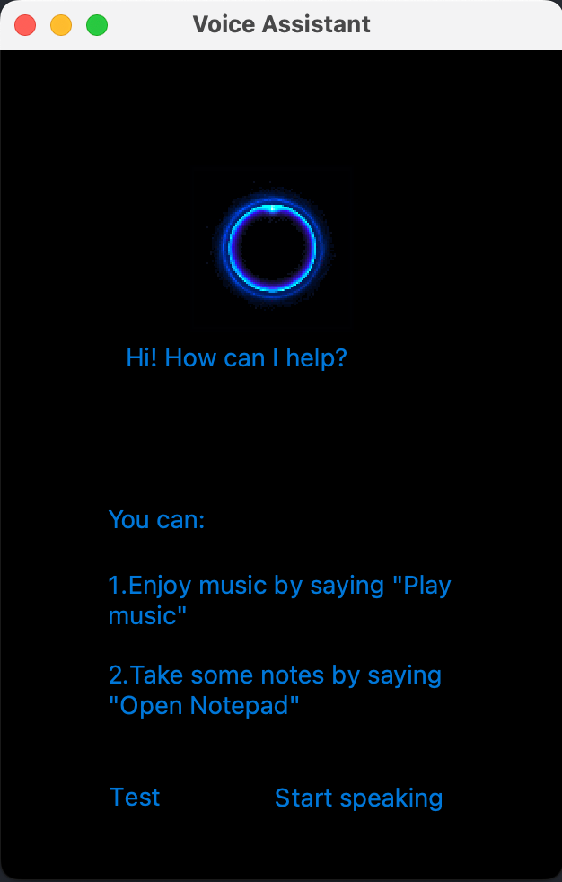
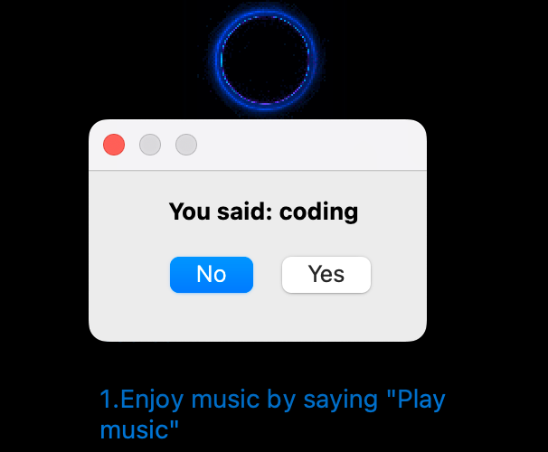
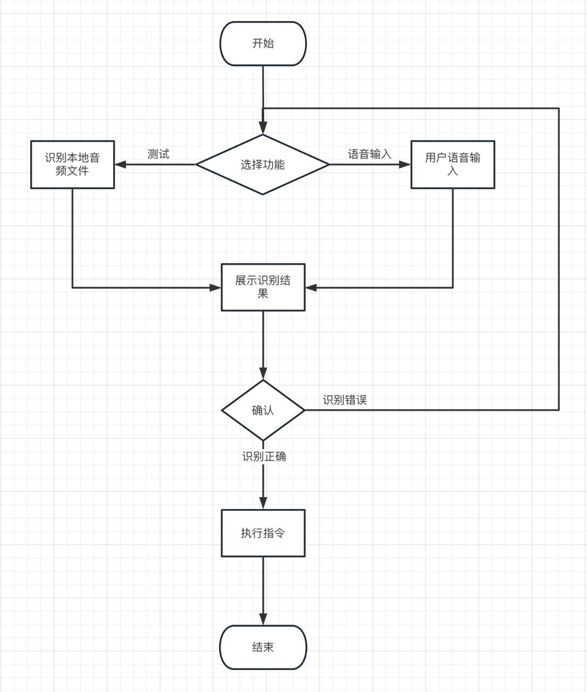

# Human-Computer Interaction

## Lab1.1-Automatic Speech Recognition

[toc]

### Introduction

- 安装依赖
  1. PocketSphinx是一个计算量和体积都很小的嵌入式语音识别引擎。

     ```sh
     pip3 install pocketsphinx
     ```
  
  2. 安装语音转文本库依赖 SpeechRecognition
  
     ```sh
     pip install SpeechRecognition
     ```
  
  3. Python音频操作工具
  
     ```sh
     brew install portaudio
     pip install pyaudio
     ```
  
  4. 可视化框架Qt
  
     ```sh
     pip install pyqt5
     ```
  
- 文件目录
  
  ```shell
  .
  ├── README.md
  ├── asr.py
  ├── asrInterface.py
  ├── guessTheWord.py
  ├── icon
  │   ├── phone.png
  │   ├── play.gif
  │   └── voice.gif
  ├── resource
  │   ├── 1.png
  │   ├── 2.png
  │   └── 3.png
  ├── test.py
  └── wav
      ├── coding.wav
      ├── game.wav
      ├── index.wav
      ├── music.wav
      └── unknown.wav
  
  4 directories, 16 files
  ```
  
  其中test.py和guessTheWord.py是单独的测试文件，asr.py是整个项目的入口程序。
  
- 运行主程序
  
  ```sh
  python asr.py
  ```
  
  
  
  选择左下方Test按钮，读取本地目录`wav/index.wav`作为用户输入，可以更改文件名以尝试不同的输入。
  
  
  
  或者点击右下方按钮Start speaking，并开始说话。程序会自动识别语音输入结束，并将输入内容转换为文字展示给用户。
  
- 流程图
  
  

### The modifications to GUI and the codes

1. 在ui上添加按钮，并在主窗口中与事件绑定，当点击按钮时，就开启录制（或从本地文件中读取音频文件用于测试）

   ```python
   # ui文件
   self.speak_btn = QtWidgets.QPushButton(self.centralwidget)
   self.speak_btn.setGeometry(QtCore.QRect(150, 390, 100, 51))
   
   self.test_btn = QtWidgets.QPushButton(self.centralwidget)
   self.test_btn.setGeometry(QtCore.QRect(50, 390, 50, 50))
   
   self.speak_btn.setText(_translate("MainWindow", "Start speaking"))
   self.test_btn.setText(_translate("MainWindow", "Test"))
   ```

   ```python
   # 主窗口
   self.ui.speak_btn.clicked.connect(partial(self.getCommand))
   self.ui.test_btn.clicked.connect(partial(self.testCommand))
   ```

   其中partial是`pyqt5`的`functools`包中一个偏函数，可以基于一个函数创建一个可调用对象，把原函数的某些参数固定，调用时只需要传递未固定的参数即可。

2. 获取用户音频（getCommand函数），在这里调用了`recognize_speech_from_mic`函数，传进去了识别器`recognizer`和`microphone`，这部分参照了模板中的函数，用于从麦克风中获取用户输入的内容，并转换为文字返回。

   ```python
   def getCommand(self):
     microphone = sr.Microphone()
     recognizer = sr.Recognizer()
     for _ in range(5):
       order = self.recognize_speech_from_mic(recognizer, microphone)
       if order["transcription"]:
         break
       if not order["success"]:
         break
       print("I didn't catch that. What did you say?\n")
     if order["error"]:
       print("ERROR: {}".format(order["error"]))
   
     print("You said: {}".format(order["transcription"]))
     self.myCommand = order["transcription"]
     self.showCommand()
   ```

3. 返回后展示给用户确认是否识别正确，如果用户选择Yes，则去执行该指令

   ```python
   def showCommand(self):
     showMessage = QtWidgets.QMessageBox()
     showMessage.setWindowTitle("提示")
     showMessage.setText("You said: {}".format(self.myCommand))
     buttonY = QtWidgets.QPushButton('Yes')
     buttonN = QtWidgets.QPushButton('No')
     showMessage.addButton(buttonY, QtWidgets.QMessageBox.YesRole)
     showMessage.addButton(buttonN, QtWidgets.QMessageBox.NoRole)
     showMessage.exec_()
     if showMessage.clickedButton() == buttonY:
       self.execCommand()
   ```

4. 执行指令前先使用`fuzzywuzzy`中的模糊匹配函数，从`commands`库中选择最匹配的一项指令，而后判断匹配度是否超过预设的阈值`score_threshold`，如果超过则直接执行，否则提示用户无法识别。

   ```python
   def execCommand(self):
     key, score, cmd = process.extractOne(self.myCommand, self.commands)
     if score > self.score_threshold:
       os.system(cmd)
     else:
       showMessage = QtWidgets.QMessageBox()
       showMessage.setWindowTitle("警告")
       showMessage.setText("Sorry, I can't recognize your command.")
       buttonY = QtWidgets.QPushButton('OK')
       showMessage.addButton(buttonY, QtWidgets.QMessageBox.YesRole)
       showMessage.exec_()
   ```

5. 其中预设变量都在init中定义。

   ```python
   self.score_threshold = 60
   self.commands = {
     "open /Applications/IntelliJ\ IDEA.app": "coding", 
     "open /Applications/NeteaseMusic.app": "play music",
     "open /Applications/Steam.app": "play game",
   }
   ```

6. 为了便于测试，增加了test按钮，用于从本地文件`./wav/index.wav中读取音频作为用户输入，这里预设了三个音频，分别对应三条指令，即

   | 语音输入     | 执行指令                                |
   | :----------- | --------------------------------------- |
   | `coding`     | `open /Applications/IntelliJ\ IDEA.app` |
   | `play music` | `open /Applications/NeteaseMusic.app`   |
   | `play game`  | `open /Applications/Steam.app`          |


### The accuracy of speech recognition and how to improve it, if possible?

1. 在这里使用的pocketsphinx库，由于是离线轻量级版本，导致识别的准确率很低，并且对于一些辅音和翘舌平舌也很难识别出俩，如play、open等词，经过了几十次尝试也并没有让它识别出来正确的结果。这可能是由于麦克风噪音比较大的原因（虽然人工听起来基本没什么噪音），也可能是语音语调不够准确，最大的原因我认为还是离线版本的模型本身质量较差，无法做到较高准确率的识别。
2. 想要提高识别的准确率，可以从以下方面入手：

   1. 调整pocketsphinx的参数：pocketsphinx提供了一系列参数，你可以尝试调整这些参数以提高识别准确率。比如换一个语言模型（使用谷歌、必应等付费api）、音频特征提取器、噪声抑制等参数。

   2. 换一个语音识别库，目前主流的Python语音识别库有：

      - CMU Sphinx (works offline)

      - Google Speech Recognition

      - Google Cloud Speech API

      - Wit.ai

      - Microsoft Azure Speech

      - Microsoft Bing Voice Recognition (Deprecated)

      - Houndify API

      - IBM Speech to Text

      - Snowboy Hotword Detection (works offline)

      上述语音识别软件库各个之间的侧重点不同，如：谷歌云语音侧重语音向文本转换，又如wit与apiai还提供超出基本语音识别的内置功能（识别讲话者意图的自然语言处理功能）。

   3. 自行训练模型，以达到更高的准确率，并能更好匹配应用场景。模型的训练需要考虑以下方面：

      1. 数据集：使用大规模、高质量的数据集对模型进行训练。可以使用一些公开可用的语音数据集，如LibriSpeech、Mozilla Common Voice等。
      2. 特征提取：语音信号是一种时域信号，需要将其转换为频域信号，即提取特征。常用的特征提取方法包括Mel频率倒谱系数（Mel-Frequency Cepstral Coefficients, MFCCs）和线性预测编码（Linear Predictive Coding, LPC）等。在选择特征提取方法时，需要考虑特征的稳定性和表征能力。
      3. 模型架构：目前比较常用的语音识别模型包括卷积神经网络（Convolutional Neural Network, CNN）、循环神经网络（Recurrent Neural Network, RNN）和Transformer等。
      4. 数据增强：通过对数据进行增强，如加入噪声、变速、变调等操作，可以提高模型的鲁棒性和泛化能力。

